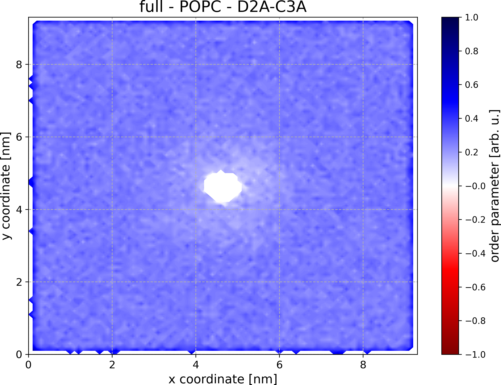

# order: Calculate Coarse-Grained Lipid Order Parameters

[](https://zenodo.org/badge/latestdoi/534343880)

This repository contains two programs: `order` and `ordermap`.

`order` is a much faster and more general version of the Martini [do-order script](http://www.cgmartini.nl/index.php/downloads/tools/229-do-order) for the calculation of coarse-grained lipid order parameters. `order` can be applied to any coarse-grained lipids which `.itp` file is provided and it does not require Gromacs. The calculated lipid order parameters are provided separately for every bond of every lipid molecule type of every membrane leaflet.

`ordermap` calculates coarse-grained lipid order parameters similarly to `order` but outputs the results for every bond of every molecule type in every leaflet as a plottable xy-map. In this way, you can get information about what parts of the membrane are ordered and what parts of the membrane are disordered.

## Dependencies

`order` and `ordermap` require you to have groan library installed. You can get groan from [here](https://github.com/Ladme/groan). See also the [installation instructions](https://github.com/Ladme/groan#installing) for groan.

## Installation

### Install both order programs

1) Run `make groan=PATH_TO_GROAN` to compile both `order` and `ordermap`. `PATH_TO_GROAN` is a path to the directory containing groan library (containing `groan.h` and `libgroan.a`).
2) (Optional) Run `make install` to copy all the compiled programs into `${HOME}/.local/bin`.

### Install order or ordermap
1) Run `make NAME_OF_THE_PROGRAM groan=PATH_TO_GROAN` to compile a selected program. For example, using `make ordermap groan=~/groan` will install the program `ordermap` while searching for the groan library in directory `~/groan`.
2) (Optional) Run `make install` to copy all the compiled programs into `${HOME}/.local/bin`.


## order

### Options

```
Usage: order -c GRO_FILE [OPTION]...

OPTIONS
-h               print this message and exit
-c STRING        gro file to read
-f STRING        xtc file to read (optional)
-n STRING        ndx file to read (optional, default: index.ndx)
-i STRING        itp file to read (default: martini_v3.0.0_phospholipids_v1.itp)
-a STRING        selection of atoms to be used for analysis (default: Membrane)
-p STRING        identifier of lipid heads (default: name PO4)
```

Use [groan selection language](https://github.com/Ladme/groan#groan-selection-language) to specify atoms to select (flags `-a` and `-p`).

Use the flag `-a` to specify atoms of lipids for which the lipid order parameters shall be calculated. Note that this selection is also used for the calculation of membrane center which is crucial for the correct assignment of lipids into membrane leaflets. Thus, this selection must contain sufficient number of sufficiently well distributed atoms to properly calculate the center of geometry.

Use the flag `-p` to specify atoms identifying lipid heads. This selection is only used to correctly assign lipids into individual membrane leaflets and there must be exactly one 'headgroup identifier' for every lipid molecule.

### Example

```
order -c system.gro -f md.xtc -n groups.ndx
```

This command will calculate lipid order parameters for bonds of atoms in the ndx group `Membrane` (default option) based on the coordinates from the trajectory `md.xtc` (every trajectory frame will be analyzed). The information about ndx groups will be read from `groups.ndx` (flag `-n`). In case there is no ndx group named `Membrane` or in case the `groups.ndx` file could not be read, `order` will complain that no atoms have been selected for the analysis and will exit.

Lipid molecules of the ndx group `Membrane` will be assigned to the upper or lower membrane leaflet based on the position of their 'headgroup identifier', which in this case is the atom with name `PO4` (default option). In case the 'headgroup identifier' is positioned above the geometric center of the selection `Membrane`, the lipid molecule is assigned to the upper leaflet. In contrast, if the 'headgroup identifier' is positioned below the geometric center of the selection `Membrane`, the lipid molecule is assigned to the lower leaflet. This assignment will be performed for every trajectory frame.

The information about bonds between the coarse-grained lipids will be read from `martini_v3.0.0_phospholipids_v1.itp` (default option).

The resulting lipid order parameters will be output individually for every bond between concerned atoms of every lipid type and for every membrane leaflet as well as for the full membrane. For example, for a Martini 3 POPC/POPE membrane (with an embedded transmembrane helix), the result of `order` analysis can look like this:
```
UPPER LEAFLET
> POPC <
NC3 - PO4: -0.124
PO4 - GL1:  0.581
GL1 - GL2: -0.181
GL1 - C1A:  0.384
C1A - D2A:  0.358
D2A - C3A:  0.285
C3A - C4A:  0.232
GL2 - C1B:  0.482
C1B - C2B:  0.493
C2B - C3B:  0.412
C3B - C4B:  0.265

> POPE <
NH3 - PO4: -0.116
PO4 - GL1:  0.606
GL1 - GL2: -0.182
GL1 - C1A:  0.395
C1A - D2A:  0.364
D2A - C3A:  0.284
C3A - C4A:  0.233
GL2 - C1B:  0.493
C1B - C2B:  0.498
C2B - C3B:  0.414
C3B - C4B:  0.266


LOWER LEAFLET
> POPC <
NC3 - PO4: -0.126
PO4 - GL1:  0.582
GL1 - GL2: -0.181
GL1 - C1A:  0.383
C1A - D2A:  0.356
D2A - C3A:  0.284
C3A - C4A:  0.232
GL2 - C1B:  0.482
C1B - C2B:  0.493
C2B - C3B:  0.411
C3B - C4B:  0.264

> POPE <
NH3 - PO4: -0.117
PO4 - GL1:  0.606
GL1 - GL2: -0.182
GL1 - C1A:  0.396
C1A - D2A:  0.365
D2A - C3A:  0.284
C3A - C4A:  0.233
GL2 - C1B:  0.493
C1B - C2B:  0.497
C2B - C3B:  0.413
C3B - C4B:  0.265


FULL MEMBRANE
> POPC <
NC3 - PO4: -0.125
PO4 - GL1:  0.582
GL1 - GL2: -0.181
GL1 - C1A:  0.384
C1A - D2A:  0.357
D2A - C3A:  0.285
C3A - C4A:  0.232
GL2 - C1B:  0.482
C1B - C2B:  0.493
C2B - C3B:  0.411
C3B - C4B:  0.264

> POPE <
NH3 - PO4: -0.117
PO4 - GL1:  0.606
GL1 - GL2: -0.182
GL1 - C1A:  0.396
C1A - D2A:  0.365
D2A - C3A:  0.284
C3A - C4A:  0.233
GL2 - C1B:  0.493
C1B - C2B:  0.497
C2B - C3B:  0.413
C3B - C4B:  0.265
```

## ordermap

### How does it work

`ordermap` generates a mesh for every membrane leaflet with bins every 0.1 nm and then, for every bin, calculates lipid order parameter of every bond of every lipid type. The resulting mesh is then output as a plottable xy-map.

### Options

```
Usage: ordermap -c GRO_FILE -f XTC_FILE [OPTION]...

OPTIONS
-h               print this message and exit
-c STRING        gro file to read
-f STRING        xtc file to read
-n STRING        ndx file to read (optional, default: index.ndx)
-i STRING        itp file to read (default: martini_v3.0.0_phospholipids_v1.itp)
-o STRING        output directory (default: order_maps)
-a STRING        selection of atoms to be used for analysis (default: Membrane)
-p STRING        identifier of lipid heads (default: name PO4)
-x FLOAT         grid dimension in x axis (default: box size from gro file)
-y FLOAT         grid dimension in y axis (default: box size from gro file)
-l INTEGER       NAN limit: how many bonds must be detected in a grid tile
                 to calculate lipid order for this tile (default: 30)
```

Use [groan selection language](https://github.com/Ladme/groan#groan-selection-language) to specify atoms to select (flags `-a` and `-p`).

Use the flag `-a` to specify atoms of lipids for which the lipid order parameters shall be calculated. Note that this selection is also used for the calculation of membrane center which is crucial for the correct assignment of lipids into membrane leaflets. Thus, this selection must contain sufficient number of sufficiently well distributed atoms to properly calculate the center of geometry.

Use the flag `-p` to specify atoms identifying lipid heads. This selection is only used to correctly assign lipids into individual membrane leaflets and there must be exactly one 'headgroup identifier' for every lipid molecule.

When using `ordermap` to analyze a membrane-protein simulation, it is a good idea to center the protein. Otherwise any interesting changes in the order parameters across the membrane might get averaged out.

### Example

```
ordermap -c system.gro -f md_centered.xtc -a "resname POPC POPE" -x 2-10 -y "0 - 12" -l 15 -o maps
```

This command will calculate lipid order parameters for bonds of atoms corresponding to residues named `POPC` or `POPE` (flag `-a`) based on the coordinates from the trajectory `md_centered.xtc` (every trajectory frame will be analyzed). Analyzed part of the simulation box can be specified using the flags `-x` and `-y`. In this case, `ordermap` will only analyze block-shaped area spanning from `2 nm` to `10 nm` on the x-axis and from `0 nm` to `12 nm` on the y-axis. The size of the area on the z-axis corresponds to the current size of the simulation box. Lipid order parameters will not be calculated for bins with fewer than 15 samples (flag `-l`) and the resulting lipid order for these bins will be 'nan' in the output file.

Lipid molecules of the selection `resname POPC POPE` will be assigned to the upper or lower membrane leaflet based on the position of their 'headgroup identifier', which in this case is the atom with name `PO4` (default option). In case the 'headgroup identifier' is positioned above the geometric center of the selection `resname POPC POPE`, the lipid molecule is assigned to the upper leaflet. In contrast, if the 'headgroup identifier' is positioned below the geometric center of the selection `resname POPC POPE`, the lipid molecule is assigned to the lower leaflet. This assignment will be performed for every trajectory frame.

The information about bonds between the coarse-grained lipids will be read from `martini_v3.0.0_phospholipids_v1.itp` (default option).

The calculated lipid order maps will be output individually for every bond between concerned atoms of every lipid type and for every membrane leaflet as well as for the full membrane. The maps will be written into the directory `maps` (flag `-o`), each in the following format:

```
# SPECIFICATION OF THE PROGRAM USED AND ITS VERSION
# ARGUMENTS OF THE COMMAND LINE
@ title LOWER/UPPER/FULL - LIPID_TYPE - BEAD1-BEAD2       <-- e.g. lower - POPC - C1A-D2A
@ titlefontsize 18
@ xlabel x coordinate [nm]
@ ylabel y coordinate [nm]
@ zlabel order parameter [arb. u.]
@ zrange -1.0 1.0 0.2
@ grid --
$ type colorbar
$ colormap seismic_r
X_COORDINATE1 Y_COORDINATE1 ORDER_PARAMETER_IN_THIS_BIN
X_COORDINATE2 Y_COORDINATE1 ORDER_PARAMETER_IN_THIS_BIN
X_COORDINATE3 Y_COORDINATE1 ORDER_PARAMETER_IN_THIS_BIN
...
X_COORDINATE1 Y_COORDINATE2 ORDER_PARAMETER_IN_THIS_BIN    <-- note that x-coordinate is the fastest changing
...
```

Note that file like the above one will be written for every bond of every lipid type and for every membrane leaflet as well as for the full membrane. When analyzing a Martini 3 simulation of a POPC/POPE membrane, this will already lead to 66 separate plottable xy-maps.


Plotted order map for D2A-C3A bonds of POPC lipids calculated from 1 μs Martini 3 simulation of a transmembrane alpha-helix in a POPC membrane can look like this:


## Limitations

The programs assume that the bilayer has been built in the xy-plane (i.e. the bilayer normal is oriented along the z-axis).

The programs will NOT provide reliable results when applied to simulations with curved bilayers or vesicles.

The programs assume that the simulation box is rectangular and that periodic boundary conditions are applied in all three dimensions.

The programs have trouble dealing with gromacs preprocessor commands in the itp file. Try to avoid them.

The programs always use center of _geometry_, instead of center of _mass_.

The programs have only been tested on Linux. Probably will not work on anything that is not UNIX-like.
